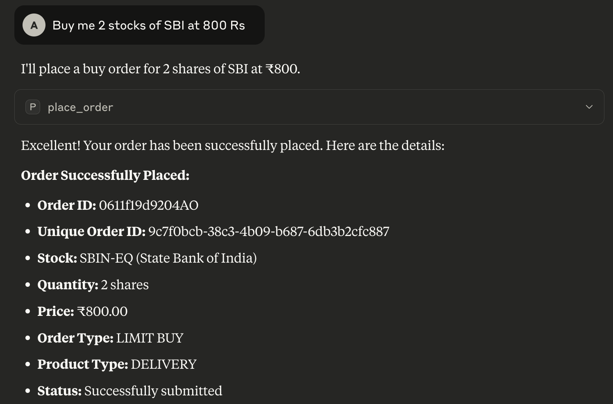
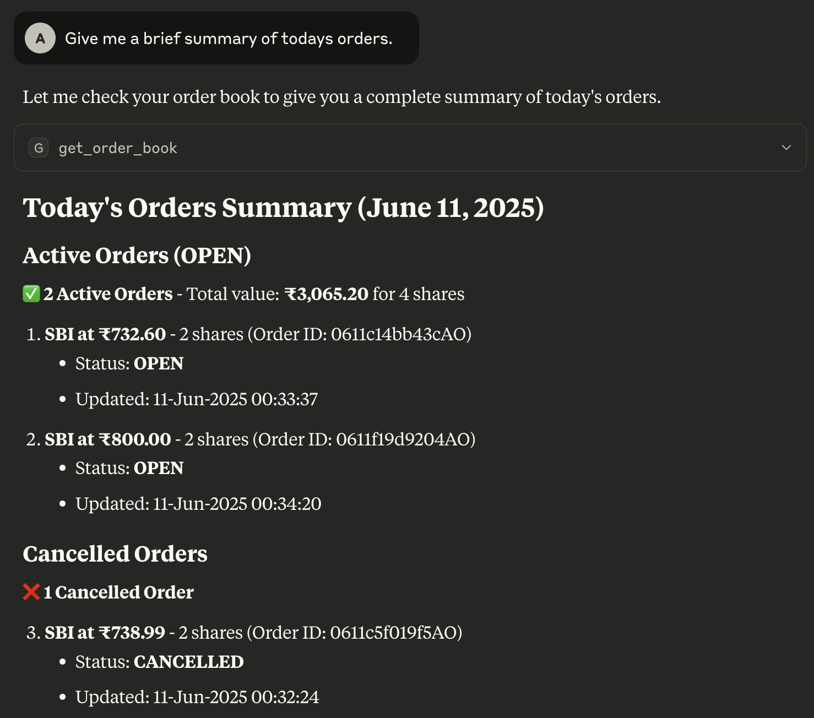

# Angel One SmartAPI Integration

This project demonstrates the integration with Angel One's SmartAPI for trading operations using Python. It provides a comprehensive interface to interact with Angel One's trading platform through their SmartAPI.

## Features

- Authentication with Angel One SmartAPI
- Portfolio management
- Historical candle data retrieval
- Order placement and management
- Customizable greeting resource
- Error handling and logging

## Prerequisites

- Python 3.10
- Angel One trading account
- API credentials from Angel One
- Claude Desktop (for enhanced development experience)
- MCP CLI (for running the FastMCP server)

## Environment Variables

Create a `.env` file in the root directory with the following variables:

```
api_key=your_api_key
username=your_username
pwd=your_password
token=your_totp_token
correlation_id=your_correlation_id
```

## Installation

1. Clone the repository:
```bash
git clone <repository-url>
cd angelone-claud-mcp
```

2. Create and activate a Python virtual environment:
```bash
python -m venv .venvs/mcp310
source .venvs/mcp310/bin/activate  # On Unix/macOS
# or
.venvs\mcp310\Scripts\activate  # On Windows
```

3. Install the required dependencies:
```bash
pip install -r requirements.txt
```

4. Install MCP CLI:
```bash
pip install mcp[cli]
```

5. Install Claude Desktop:
   - Download Claude Desktop from the official website
   - Follow the installation instructions for your operating system
   - Launch Claude Desktop

6. Configure Claude Desktop:
   - Open Claude Desktop
   - Go to Settings
   - Add the following configuration to your `claude_desktop_config.json`:
   ```json
   {
     "mcpServers": {
       "Demo": {
         "command": "/path/to/your/venv/bin/mcp",
         "args": [
           "run",
           "/path/to/your/project/main.py"
         ]
       }
     }
   }
   ```
   Replace `/path/to/your/venv/bin/mcp` with the actual path to your MCP executable and `/path/to/your/project/main.py` with the actual path to your main.py file.

## Usage

The project uses FastMCP to create a server that exposes various trading functionalities. Here are the main features:

### Portfolio Management
- `get_proftfolio()`: Retrieves the user's portfolio holdings


*Example of portfolio holdings display*

### Market Data
- `get_candle_data(start_time, end_time, symboltoken, interval)`: Retrieves historical candlestick data
  - Parameters:
    - `start_time`: Start date and time in "YYYY-MM-DD HH:MM" format
    - `end_time`: End date and time in "YYYY-MM-DD HH:MM" format
    - `symboltoken`: The symbol token for the stock (default: "3045")
    - `interval`: Time interval for the data (e.g., "ONE_MINUTE", "FIVE_MINUTE", "ONE_DAY")


### Order Management
- `place_order(symbol, symboltoken, transactiontype, quantity, ordertype, producttype, price)`: Places a new order
  - Parameters:
    - `symbol`: Trading symbol of the stock
    - `symboltoken`: Symbol token of the stock
    - `transactiontype`: "BUY" or "SELL"
    - `quantity`: Quantity to be traded
    - `ordertype`: Type of order (default: "LIMIT")
    - `producttype`: Product type (default: "DELIVERY")
    - `price`: Price at which to place the order (default: 0)


*Example of order placement interface*

- `cancel_order(order_id, variety)`: Cancels an existing order
  - Parameters:
    - `order_id`: The order ID to cancel
    - `variety`: Order variety (default: "NORMAL")

- `get_order_book()`: Retrieves the current order book


*Example of order book display*

### Other Features
- `greeting://{name}`: Returns a personalized greeting

To run the server:
```bash
python main.py
```

## Security

- API credentials are stored in environment variables
- TOTP (Time-based One-Time Password) authentication is implemented
- Sensitive information is not hardcoded in the source code
- All API calls are wrapped in try-except blocks for proper error handling

## Error Handling

The application implements comprehensive error handling:
- Authentication failures are logged and raised
- API call failures are caught and logged
- All functions return appropriate error responses when operations fail

## Contributing

Feel free to submit issues and enhancement requests.

## License

This project is licensed under the MIT License - see the LICENSE file for details.